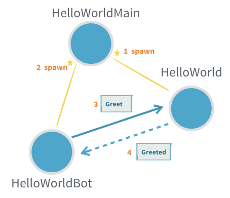

HelloWorldMain acts as the initiator, sending the initial SayHello message to start the communication.<br>
HelloWorld and HelloWorldBot then take over the ongoing communication, with the HelloWorldBot sending Greet messages and the HelloWorld actor responding with Greeted messages.<br>
This pattern is common in Akka applications, where a higher-level actor can coordinate the interactions between other actors.

In ez words<br>
Just to initialize the communication the HelloWorldMain is used (SayHello) and once the communication is established HelloWorld and HelloWorldBot both facilitates the communication

Explanation of this code
```scala
object HelloWorldBot {

  def apply(max: Int): Behavior[HelloWorld.Greeted] = {
    bot(0, max)
  }

  private def bot(greetingCounter: Int, max: Int): Behavior[HelloWorld.Greeted] =
    Behaviors.receive { (context, message) =>
      val n = greetingCounter + 1
      context.log.info2("Greeting {} for {}", n, message.whom)
      if (n == max) {
        Behaviors.stopped
      } else {
        message.from ! HelloWorld.Greet(message.whom, context.self)
        bot(n, max)
      }
    }
}
```

The greetingCounter and max variables in the HelloWorldBot code are used to track the number of greetings sent and the maximum allowed greetings, respectively.

- greetingCounter: This variable keeps track of how many times the bot has greeted the HelloWorld actor. It's initialized to 0 and incremented each time a Greeted message is received.<br>
- max: This variable represents the maximum number of greetings the bot is allowed to send. It's set as an argument to the HelloWorldBot object, allowing you to control the number of greetings.

Here's how they work together:
1. The bot function is called with greetingCounter set to 0 and max set to the desired maximum number of greetings.
2. Each time the bot receives a Greeted message, it increments the greetingCounter.
3. If the greetingCounter equals max, the bot stops (returns Behaviors.stopped).
4. If the greetingCounter is less than max, the bot sends another Greet message to the HelloWorld actor and calls the bot function again with the incremented greetingCounter.<br>

This way, the HelloWorldBot can continue to send greetings until it reaches the specified maximum, ensuring that it doesn't send an infinite number of messages.

**Remember, the HelloWorldMain actor is the top-level actor in this system. It's responsible for creating and managing the HelloWorld and HelloWorldBot actors. When you send a message to the system, it's essentially being sent to the root actor within that system, which is HelloWorldMain in this case.**
### How the flow actually works
1. HelloWorldMain receives the SayHello message.
2. HelloWorldMain spawns a new HelloWorldBot actor with the specified name.
3. HelloWorldMain sends a Greet message to the HelloWorld actor, passing the name from the SayHello message and the reference to the newly created HelloWorldBot actor.
4. HelloWorld responds with a Greeted message to the HelloWorldBot.
5. HelloWorldBot receives the Greeted message and can continue its interactions with the HelloWorld actor as needed.
   So, the HelloWorldMain actor is essentially acting as a mediator, receiving the initial SayHello messages and initiating the communication between the HelloWorld and HelloWorldBot actors.

**In a NutShell** - The HelloWorldMain itself creates both the actors sends the message to the first actor on behalf of the second actor and then gives the reference of the second actor to the first actor and then both the actors further facilitates the communication.

**Extras**<br>
<br>
The diagram illustrates the interaction between three actors in an Akka application:

1. HelloWorldMain: This is the main actor that creates and manages the other two actors.
2. HelloWorld: This actor is responsible for greeting someone.
3. HelloWorldBot: This actor is a client that sends greeting requests to the HelloWorld actor and receives responses.

Here's a breakdown of the diagram:
1. spawn: The HelloWorldMain actor creates the HelloWorld actor using the spawn method.
2. spawn: The HelloWorldMain actor creates the HelloWorldBot actor using the spawn method.
3. Greet: The HelloWorldMain actor sends a Greet message to the HelloWorld actor.
4. Greeted: The HelloWorld actor sends a Greeted message back to the HelloWorldBot.<br>

This sequence shows how the HelloWorldMain actor acts as a mediator, initiating the communication between the HelloWorld and HelloWorldBot actors. The HelloWorldBot then sends further Greet messages to the HelloWorld actor, creating a continuous interaction.

**For Better understanding, lets compare with the real life example**<br>

**Imagine a reception desk in a company.**
1. Receptionist (HelloWorldMain): This is the main person at the reception desk.<br>
2. Customer (HelloWorldBot): This is a visitor who wants to be greeted.<br>
3. Greeter (HelloWorld): This is the person who greets the visitors.<br>

**Flow:**<br>
1. Customer arrives: A customer arrives at the reception desk and requests to be greeted (equivalent to sending a SayHello message to HelloWorldMain).<br>
2. Receptionist greets customer: The receptionist (HelloWorldMain) sees the customer and calls the greeter (spawns the HelloWorld actor).<br>
3. Greeter greets customer: The greeter (HelloWorld) greets the customer (sends a Greeted message to the HelloWorldBot).<br>
4. Customer may request additional greetings: The customer (HelloWorldBot) might ask for more greetings, depending on the bot's configuration (e.g., maximum greetings).<br>

In this analogy, the receptionist (HelloWorldMain) acts as the intermediary, coordinating the greeting between the customer (HelloWorldBot) and the greeter (HelloWorld).<br>